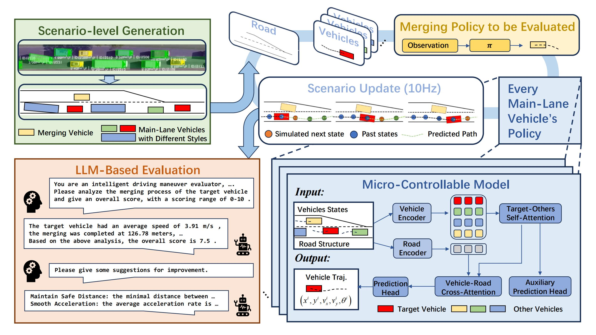
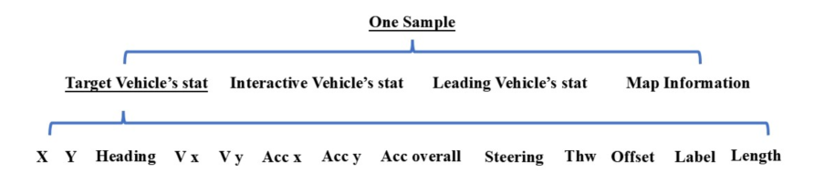
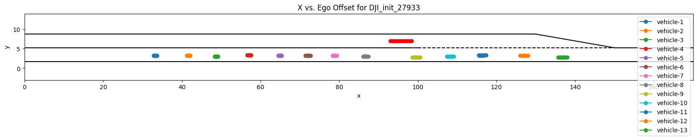
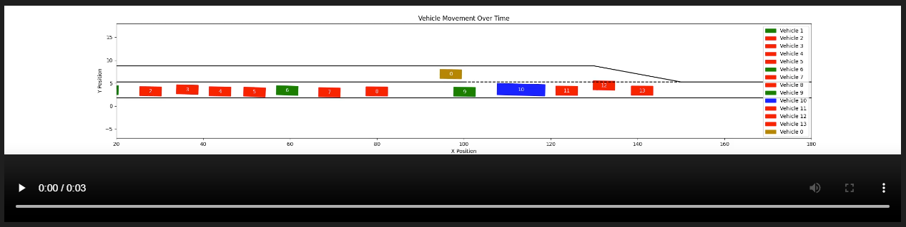

<!-- # Bench4Merge
A Comprehensive Benchmark for Merging in Realistic Dense Traffic with Micro-Interactive Vehicles -->

<h1 align="center">Bench4Merge: A Comprehensive Benchmark for Merging in Realistic Dense Traffic with Micro-Interactive Vehicles</h1>

<!-- Main text can be obtained from this link: [Bench4Merge](https://arxiv.org/abs/2410.15912) -->

<p align="center">
<a href="https://arxiv.org/abs/2410.15912"></a>
<a href="https://youtu.be/2ZBHL5UC4_c?si=Hw3YmFOiFiDbqxZ5"></a>
<a href="https://github.com/WZM5853/Bench4Merge/LICENSE"></a>
</p>

<h4 align="center"><em><a href="https://github.com/WZM5853">Zhengming Wang</a>*,
<a href="https://github.com/wjl2244">Junli Wang</a>,  
<a href="https://github.com/Philipflyg">Pengfei Li</a>,
<a href="#">Zhaohan Li</a>, 
<a href="#">Chunyang Liu</a>, 
<a href="#">Bo Zhang</a>📧</em>, 
<a href="#">Peng Li</a>📧</em>, 
<a href="#">Yilun Chen</a>, 
</h4>

<h5 align="center">
<br>📧 indicates corresponding authors.<br>
<b > AIR, Tsinghua University &nbsp; | &nbsp; Didi Chuxing &nbsp; | &nbsp; Zhejiang University &nbsp; | &nbsp; CASIA <b >
<a></a>
</h5>

## Abstract
<h2 align="center">
  
</h2>

Comprehensively evaluating the capabilities of autonomous driving systems presents a significant challenge, particularly in densely interactive scenarios. Bench4Merge offers an innovative approach. Firstly, it introduces an initial scenario extractor based on real-world data to derive representative driving scenarios. Secondly, the traffic participants within the environment are derived from large-scale training, enabling the accurate simulation of microscopic interaction behaviors. Finally, we have designed an evaluator based on a large language model (LLM), which is capable of assigning quantitative scores to the driving performance of autonomous vehicles and identifying potential optimization pathways.

## Dataset <a name="citation"></a>
In order to train main lane vehicles in dense traffic environments, we extracted over 500000 following segments that meet the requirements of dense traffic scenarios from three public traffic datasets. Based on this, we trained and obtained the micro interactive behavior of main lane vehicles mentioned in this work.

Each data sample contains information about the **Target Vehicle, Leading Vehicle, Interactive Vehicle, and the Map Information**. Each vehicle is represented by an **11-dimensional vector**, which corresponds to the following parameters in order: 

<h2 align="center">
  
</h2>

To achieve the .pkl data, please clink this link: [Main-Lane-Vehicle-Training-Data](https://pan.baidu.com/s/1Bq9lTYoVndZYVuZ2KnXLfg?pwd=m7nx)

## Using Process <a name="citation"></a>
How to use the Bench4Merge?
  - First, generate an initial environment
    ```bash
        # we make .ipynb for easier observation of the initial environment
        python create_init.py
    ```
    <h2 align="center">
        
    </h2>
    
    It should be noted that please download the initial environment files classified in this article first and place them in the corresponding directory:
    ```bash
        Bench4Merge\ 
          DJI_init\
            DJI_high_dhw_results.pkl
            DJI_medium_dhw_results.pkl
            DJI_low_dhw_results.pkl
        # You can choose which initial environment to extract in create_init.py
    ```

    Those files can be obtained at: [Environment-Generate-Data](https://pan.baidu.com/s/1KLBaxnuq0fs289G-st_xrg?pwd=s7cf)

  - Second, run the merging process base on the initial environment
    ```bash
        python test_overall.py
    ```
    We provide three implemented methods for comparison: RL method, RL combined with MPC method, and optimization based method. You can implement your personal algorithm based on this framework and compare with them.

    The existing model files is **Model_Hiera_RL.zip** and **Model_RL_DDPG.zip**, Corresponding to two RL methods respectively, you can invoke them in test-overall.py.

  - Third, observe and analyze the merging process
    The vehicle's trajectory is saved in:
    ```bash
        Bench4Merge\ 
          result\
            trajectory.csv # Trajectory information of the entire process
            trajectory_1.csv # Trajectory information of the last 1 frame
            trajectory_10.csv # Trajectory information of the last 10 frame
    ```
    You can watch a video of the merging process through vis2.ipynb
    <h2 align="center">
        
    </h2>


# Comprehensive evaluation based on LLM <a name="citation"></a>

This paper uses the Alibaba Q-wen 70B large model as the evaluation, and the prompt design and calling method are as follows:

```bash
    python evaluate.py
```
LLM will give you the overall score of your method.

Welcome to make more optimizations on our basis to assist in the application of evaluation benchmarks for LLM.


## Citation <a name="citation"></a>

Please consider citing our papers if the project helps your research with the following BibTex:

```bibtex
@article{wang2024bench4merge,
  title={Bench4Merge: A Comprehensive Benchmark for Merging in Realistic Dense Traffic with Micro-Interactive Vehicles},
  author={Wang, Zhengming and Wang, Junli and Li, Pengfei and Li, Zhaohan and Li, Peng and Chen, Yilun},
  journal={arXiv preprint arXiv:2410.15912},
  year={2024}
}
```


